# Vibe Coding for Students 2026

A collection of websites and web-based games for students learning to vibe-code with AI.

## What is this?

This is a monorepo where each student project lives in its own folder. Projects are built with HTML, CSS, and JavaScript — no frameworks, no build tools, just code.

## Getting Started

1. Create a new folder at the repo root for your project.
2. Add an `index.html` as your entry point.
3. Use the folder structure from the [copilot instructions](.github/copilot-instructions.md) as a guide.

## Previewing Your Project

Open `index.html` directly in your browser, or start a local server:

```bash
cd your-project-folder && python3 -m http.server 5500
```

Then visit `http://localhost:5500`.

## Your Projects

This is where your projects will appear. Create a new folder, start vibe-coding, and add your project here!

| Preview | Project | Description |
|---------|---------|-------------|

## Starter Projects

These are ready-to-go projects with basic structure and starter content. Open one, then customise it to make it your own!

| Preview | Project | Description |
|---------|---------|-------------|
| 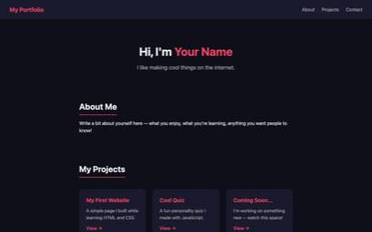 | [portfolio](portfolio/README.md) | Personal homepage with about section, project showcase, and contact form |
| 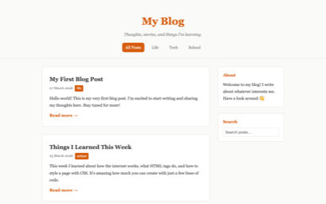 | [blog](blog/README.md) | Blog with posts, tag filtering, search, and a sidebar |
| 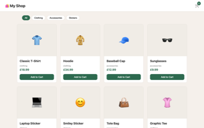 | [e-commerce](e-commerce/README.md) | Online shop with product grid, category filters, and a cart drawer |
| 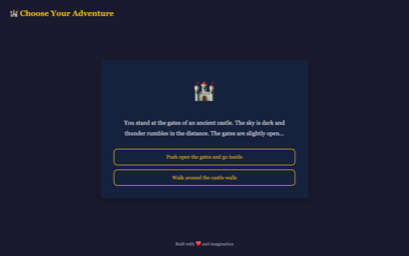 | [interactive-story](interactive-story/README.md) | Choose-your-adventure game with branching paths and multiple endings |
| 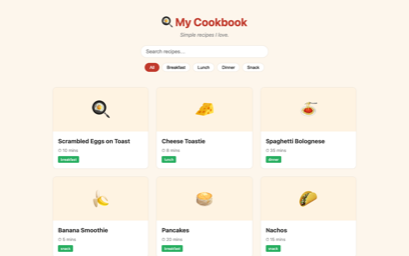 | [cookbook-site](cookbook-site/README.md) | Recipe collection with search, meal-type filters, and detail modals |
| 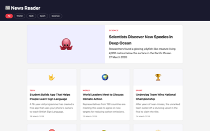 | [news-reader](news-reader/README.md) | News site with featured article, category filters, and article cards |

### More Ideas

Want to build something from scratch? Pick one of these, create a new folder, and start vibe-coding with AI!

| Idea | What to Build |
|------|---------------|
| Countdown Timer | Pick a future date and show a live countdown with days, hours, minutes, and seconds |
| Random Quote Machine | Display a random inspirational quote and let users copy or share it |
| Tip Calculator | Enter a bill amount, pick a tip %, and split it between friends |
| Colour Guessing Game | Show an RGB value and make the player guess which colour it matches |
| To-Do List | Add, complete, and delete tasks — save them to localStorage |
| Rock Paper Scissors | Play against the computer with score tracking and animations |
| Mood Journal | Log your mood each day with an emoji and see a weekly summary |
| Unit Converter | Convert between units like km/miles, kg/lbs, or °C/°F |
| Reaction Time Tester | Click as fast as you can when the screen changes colour and track your best time |
| Recipe Card Maker | Enter a recipe name, ingredients, and steps, then display it as a styled card |
| Stopwatch | Start, stop, lap, and reset — display times in a clean UI |
| Dice Roller | Roll one or more dice with animation and keep a history of rolls |
| Bookmark Manager | Save, tag, and search your favourite links — stored in localStorage |
| Daily Affirmation App | Show a new positive affirmation each day with a calming background |
| Simple Drawing Pad | Draw freehand on a canvas with colour and brush size controls |

## Example Projects

Explore the projects below to see what you can build! Each folder has a README with full details and working source code you can learn from.

### Games

| Preview | Project | Description |
|---------|---------|-------------|
|  | [endless-runner](endless-runner/README.md) | Side-scrolling character dodging obstacles with high score tracking |
| 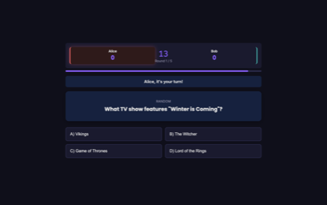 | [quiz-battle](quiz-battle/README.md) | Two-player trivia game, head-to-head on the same screen |
|  | [dungeon-crawler](dungeon-crawler/README.md) | Grid-based dungeon exploration with turn-based combat and loot |
| 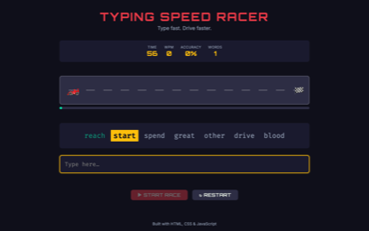 | [typing-speed-racer](typing-speed-racer/README.md) | Race a car by typing words correctly as fast as you can |
|  | [memory-card-match](memory-card-match/README.md) | Classic card-matching memory game with timer and difficulty levels |
| 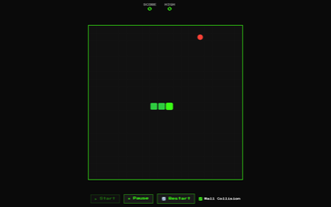 | [snake-with-powerups](snake-with-powerups/README.md) | Classic snake enhanced with speed boosts, slow-motion, and multipliers |
| 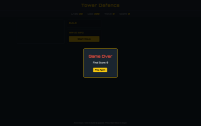 | [tower-defence](tower-defence/README.md) | Place turrets to stop waves of enemies from reaching the end |

### Creative Tools

| Preview | Project | Description |
|---------|---------|-------------|
| 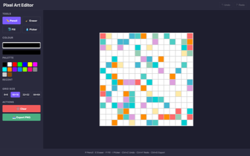 | [pixel-art-editor](pixel-art-editor/README.md) | Browser-based pixel art drawing tool with colour picker and PNG export |
| 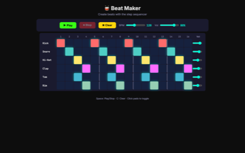 | [beat-maker](beat-maker/README.md) | Tap drum pads to layer loops and melodies with tempo control |
| 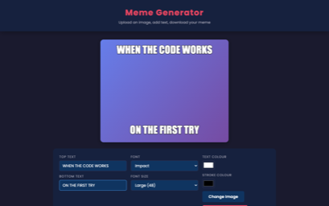 | [meme-generator](meme-generator/README.md) | Upload an image, add top/bottom text, download your meme |
| 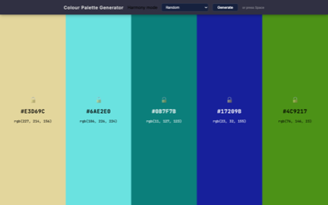 | [colour-palette-generator](colour-palette-generator/README.md) | Generate harmonious colour schemes and copy hex codes |

### Productivity

| Preview | Project | Description |
|---------|---------|-------------|
| 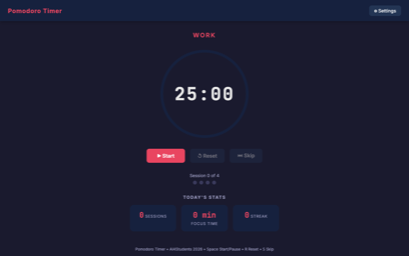 | [pomodoro-timer](pomodoro-timer/README.md) | Study timer with work/break intervals and session stats |
| 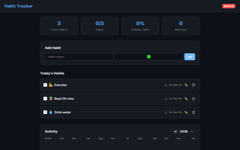 | [habit-tracker](habit-tracker/README.md) | Daily habit check-offs with streaks and a calendar heatmap |
| 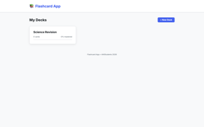 | [flashcard-app](flashcard-app/README.md) | Create decks, flip cards, and track mastery |
| 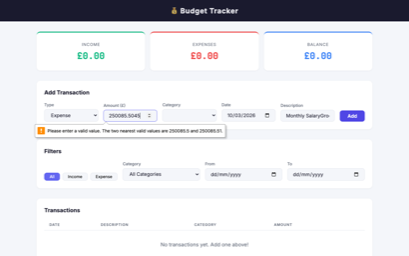 | [budget-tracker](budget-tracker/README.md) | Log income and expenses with visual chart breakdowns |

### Fun / Social

| Preview | Project | Description |
|---------|---------|-------------|
| 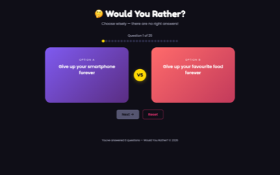 | [would-you-rather](would-you-rather/README.md) | Random dilemma generator with vote tracking |
| 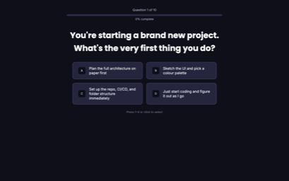 | [personality-quiz](personality-quiz/README.md) | Answer questions and get a fun personality result |
| 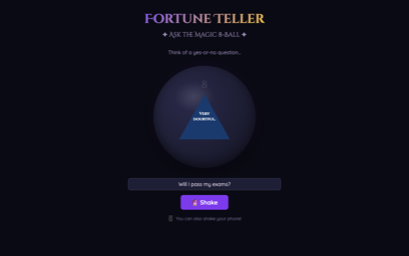 | [fortune-teller](fortune-teller/README.md) | Magic 8-Ball with shake animation and random responses |
| 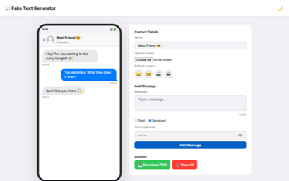 | [fake-text-generator](fake-text-generator/README.md) | Design fake chat conversations for memes or storytelling |
| 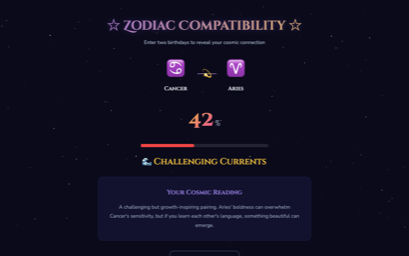 | [zodiac-compatibility](zodiac-compatibility/README.md) | Enter two birthdays, get a dramatic compatibility reading |

### Data / Visual

| Preview | Project | Description |
|---------|---------|-------------|
| 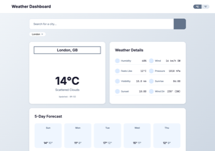 | [weather-dashboard](weather-dashboard/README.md) | Fetch weather data from a free API and display forecasts |
| 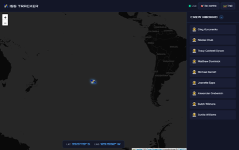 | [space-tracker](space-tracker/README.md) | Real-time ISS position on a map with crew info |
| 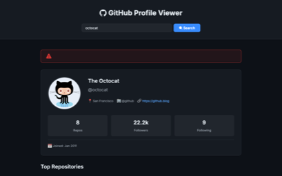 | [github-profile-viewer](github-profile-viewer/README.md) | Search a GitHub username and view their profile and repos |
| 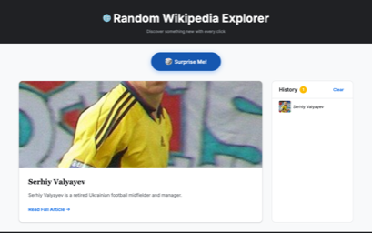 | [random-wikipedia-explorer](random-wikipedia-explorer/README.md) | Fetch random Wikipedia articles with a "surprise me" button |

### Simulation

| Preview | Project | Description |
|---------|---------|-------------|
| 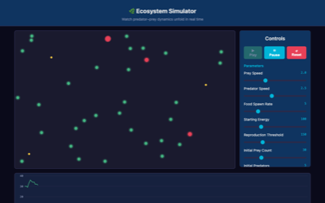 | [ecosystem-simulator](ecosystem-simulator/README.md) | Predators and prey interacting on a canvas with population graphs |
| 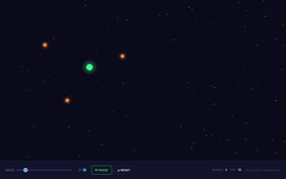 | [gravity-sandbox](gravity-sandbox/README.md) | Place planets and watch them orbit under simulated gravity |
| 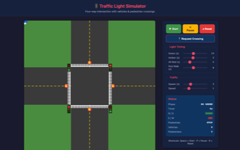 | [traffic-light-simulator](traffic-light-simulator/README.md) | Model an intersection with traffic lights, cars, and pedestrians |
| 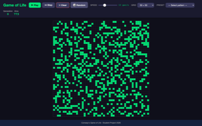 | [game-of-life](game-of-life/README.md) | Conway's cellular automaton with drawing and preset patterns |
