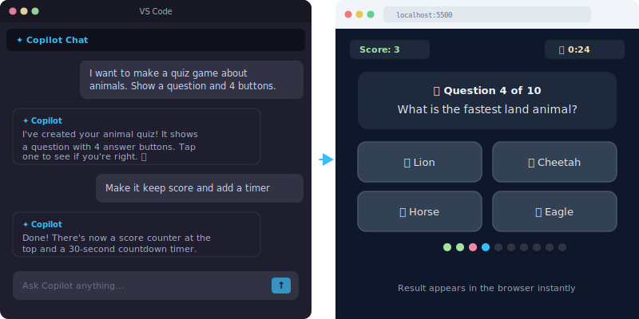

[← Back to all projects](../README.md)

# Intro to Vibe Coding

A 3-minute presentation introducing students to vibe coding with GitHub Copilot.

[🌐 Open Presentation](index.html)

---

## Slide 1 — What if you could build a website just by describing it?

No tutorials. No experience needed. Just your ideas.

---

## Slide 2 — What is Vibe Coding?

| | Step | Description |
|---|---|---|
|  | 🗣️ **You describe** | Tell AI what you want in plain English |
|  | 🤖 **AI builds** | GitHub Copilot writes the code for you |
|  | 👀 **You see results** | Open the browser and watch it come to life |

It's like **directing a movie** — you decide *what* happens, the AI figures out *how*.

---

## Slide 3 — People have already built all of this

| | | | |
|---|---|---|---|
|  |  |  |  |
| Pixel Art Editor | Snake Game | Beat Maker | Personality Quiz |
|  |  |  |  |
| Dungeon Crawler | Weather Dashboard | Endless Runner | Memory Match |

All built by describing ideas in plain English — no coding experience needed.

---

## Slide 4 — Here's what you'll do

| | Step | Description |
|---|---|---|
|  | 💡 **Pick an idea** | Choose a starter project or dream up your own |
|  | 💬 **Describe it to Copilot** | Type what you want in plain English inside VS Code |
|  | 🌐 **See it in the browser** | Your website appears — tweak it, add features, make it yours |

---

## Slide 5 — Quick tips before you start

| | Tip | Description |
|---|---|---|
|  | 🎯 **Be specific** | "Add a red button that plays a drum sound" works way better than "make it cool" |
|  | 🧱 **Build step by step** | Start simple, then keep adding. Don't try to describe everything at once. |
|  | 🧪 **Experiment!** | Nothing can break permanently. Just try things and see what happens. |

Open VS Code, pick an idea, and tell Copilot what to build. **Go!** 🚀
